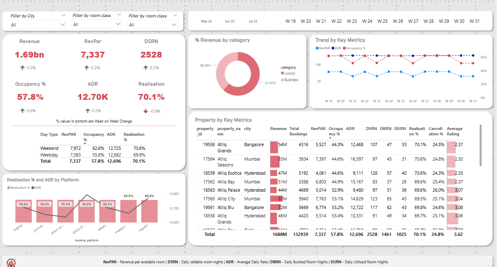

# 🏨 Hospitality Revenue Analytics Dashboard

## 📌 Project Overview

The **Hospitality Revenue Analytics Dashboard** is an interactive **Power BI** dashboard designed to analyze hotel performance across multiple properties and cities. It provides valuable business insights into revenue, occupancy, booking trends, customer behavior, and hotel performance, enabling stakeholders to make informed, data-driven decisions.

The dashboard leverages **Power BI**, **Power Query**, **DAX**, and a **Star Schema** data model to transform raw booking data into actionable business intelligence.

---

## 🎯 Business Objective

The primary objective of this project is to help hotel management:

- Monitor overall business performance
- Track revenue and occupancy trends
- Compare hotel performance across cities
- Analyze booking platform effectiveness
- Improve pricing and revenue management strategies
- Identify high-performing and underperforming properties

---

## 🛠️ Tools & Technologies

- **Power BI Desktop**
- **Power Query (ETL)**
- **DAX (Data Analysis Expressions)**
- **Data Modeling (Star Schema)**
- **CSV Dataset**

---

## 📂 Dataset

The project consists of **5 CSV files**.

### Dimension Tables

#### 1. dim_date
Contains calendar information such as:
- Date
- Month-Year
- Week Number
- Day Type (Weekday/Weekend)

#### 2. dim_hotels
Contains hotel information including:
- Property ID
- Property Name
- Hotel Category (Luxury / Business)
- City

#### 3. dim_rooms
Contains room information including:
- Room Type
- Room Class (Standard, Elite, Premium, Presidential)

### Fact Tables

#### 4. fact_aggregated_bookings
Contains aggregated booking information including:
- Property ID
- Check-in Date
- Room Category
- Successful Bookings
- Room Capacity

#### 5. fact_bookings
Contains detailed booking transactions including:
- Booking ID
- Booking & Check-in Dates
- Check-out Date
- Number of Guests
- Booking Platform
- Booking Status
- Customer Rating
- Revenue Generated
- Revenue Realized

---

## ⭐ Data Model

The dashboard follows a **Star Schema** consisting of:

- **3 Dimension Tables**
  - dim_date
  - dim_hotels
  - dim_rooms

- **2 Fact Tables**
  - fact_bookings
  - fact_aggregated_bookings

This model improves report performance and simplifies DAX calculations.

---

## 📊 Key Performance Indicators (KPIs)

The dashboard provides the following business KPIs:

- 💰 Revenue
- 📈 RevPAR (Revenue Per Available Room)
- 💵 ADR (Average Daily Rate)
- 🛏️ Occupancy %
- 🏨 DSRN (Daily Sellable Room Nights)
- ✅ Revenue Realization %
- ⭐ Average Customer Rating
- ❌ Cancellation %

---

## 📈 Dashboard Features

### Executive Summary
- Total Revenue
- RevPAR
- ADR
- Occupancy %
- DSRN
- Revenue Realization %

### Revenue Analysis
- Weekly Revenue Trend
- Revenue by Hotel Category
- Revenue by Property
- Revenue by Booking Platform

### Property Performance
Compare hotels based on:
- Revenue
- Total Bookings
- RevPAR
- Occupancy %
- ADR
- DSRN
- Realization %
- Cancellation %
- Customer Rating

### Booking Platform Analysis
Analyze:
- Revenue
- ADR
- Realization %
- Booking Distribution

### Interactive Filters
Users can filter the report by:
- City
- Room Class
- Week Number

---

## 📐 DAX Measures

Some of the key DAX measures used include:

### Revenue

```DAX
Revenue =
SUM(fact_bookings[revenue_realized])
```

### Occupancy %

```DAX
Occupancy % =
DIVIDE(
SUM(fact_aggregated_bookings[successful_bookings]),
SUM(fact_aggregated_bookings[capacity])
)
```

### ADR

```DAX
ADR =
DIVIDE(
SUM(fact_bookings[revenue_realized]),
COUNTROWS(
FILTER(
fact_bookings,
fact_bookings[booking_status]="Checked Out"
)
)
)
```

### RevPAR

```DAX
RevPAR =
DIVIDE(
[Revenue],
SUM(fact_aggregated_bookings[capacity])
)
```

### Revenue Realization %

```DAX
Realization % =
DIVIDE(
SUM(fact_bookings[revenue_realized]),
SUM(fact_bookings[revenue_generated])
)
```

---

## 📊 Business Questions Answered

This dashboard helps answer questions such as:

- Which city generates the highest revenue?
- Which hotels perform the best?
- Which room categories contribute the most revenue?
- How does occupancy vary over time?
- Which booking platform generates the highest revenue?
- What is the cancellation percentage?
- How do weekdays compare with weekends?
- Which hotels require operational improvements?

---

## 📸 Dashboard Preview

### Home Dashboard

```markdown

```

---

## 📁 Project Structure

```
Hospitality-Revenue-Analytics/
│
├── Dataset/
│   ├── dim_date.csv
│   ├── dim_hotels.csv
│   ├── dim_rooms.csv
│   ├── fact_aggregated_bookings.csv
│   └── fact_bookings.csv
│
├── Dashboard/
│   └── Hospitality Dashboard.pbix
│
├── Images/
│   └── Home Dashboard.png
│
└── README.md
```

---

## 🚀 Key Skills Demonstrated

- Power BI Dashboard Development
- Data Modeling (Star Schema)
- Power Query (ETL)
- DAX Calculations
- Business Intelligence
- Data Visualization
- KPI Development
- Hospitality Analytics
- Interactive Reporting
- Analytical Thinking

---

## 📈 Key Insights

- Identified revenue trends across multiple weeks.
- Compared hotel performance across different cities.
- Analyzed occupancy patterns for weekdays and weekends.
- Evaluated booking platform performance.
- Compared ADR, RevPAR, and Occupancy across hotels.
- Identified hotels with high cancellation rates.
- Monitored customer ratings and overall hotel performance.

---

## 🔮 Future Enhancements

- Add forecasting using Power BI Forecasting.
- Integrate real-time hotel booking data.
- Include customer segmentation analysis.
- Add drill-through reports for property-level insights.
- Develop predictive occupancy and revenue models using Machine Learning.

---

## 👩‍💻 Author

**Akanksha Agre**

B.E. Electronics & Telecommunication Engineering

Aspiring **Data Analyst | Business Intelligence Analyst | AI & Machine Learning Enthusiast**

**Skills:** Power BI • SQL • Python • Machine Learning • Data Analytics

---

⭐ **If you found this project helpful, please consider giving it a star!**